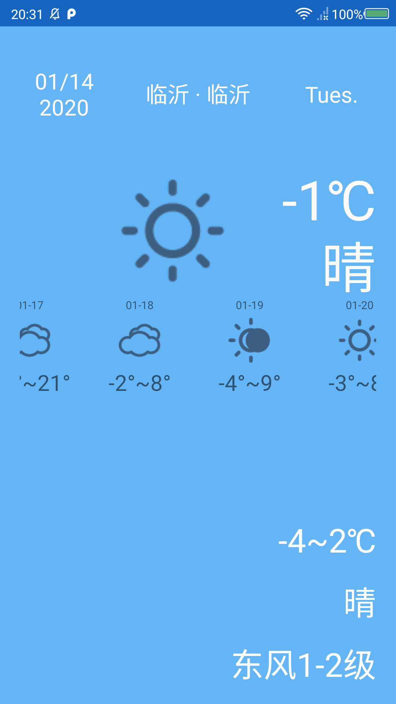

# 天气预报app开发文档

## 1901210380 符豫

### 项目地址：https://github.com/YangShaw/MyApplication
---
**目录**
<!-- TOC -->

- [天气预报app开发文档](#天气预报app开发文档)
    - [1901210380 符豫](#1901210380-符豫)
        - [项目地址：https://github.com/YangShaw/MyApplication](#项目地址httpsgithubcomyangshawmyapplication)
- [功能模块](#功能模块)
    - [主界面](#主界面)
    - [城市选择](#城市选择)
    - [后台更新](#后台更新)
    - [七日天气](#七日天气)
    - [图片资源映射](#图片资源映射)
    - [网络请求](#网络请求)
- [组件选用](#组件选用)
    - [列表 RecyclerView](#列表-recyclerview)
    - [抽屉式布局 DrawerLayout](#抽屉式布局-drawerlayout)
    - [下拉刷新](#下拉刷新)
    - [悬浮按钮](#悬浮按钮)
    - [约束性布局](#约束性布局)
- [代码规范](#代码规范)
    - [布局文件layout：](#布局文件layout)
    - [与安卓组件相对应的Java类的命名：](#与安卓组件相对应的java类的命名)
    - [布局中的控件名：](#布局中的控件名)
    - [Java类中对应的UI控件变量：](#java类中对应的ui控件变量)
    - [图片资源drawable命名：](#图片资源drawable命名)
    - [包命名：](#包命名)
- [编写爬虫获得天气图标](#编写爬虫获得天气图标)

<!-- /TOC -->
--- 

# 功能模块

## 主界面

主界面中显示的内容包括：当前日期（年月日和星期），当前城市，实况天气（温度，天气状况，天气状况图标），近七日天气情况，今日天气（温度范围，天气状况，风力）。

主界面左侧可以右滑出一个半屏的抽屉式界面（或点击城市名称）来选择当前显示的城市。主界面可以下拉刷新。

界面的布局使用ConstraintLayout约束性布局，界面的下拉刷新使用SwipeRefreshLayout，界面中部的近七日天气情况滚动列表使用RecyclerView，抽屉式页面使用DrawerLayout，页面中的滚动布局使用ScrollView和ListView，按钮使用FloatingActionButton。

## 城市选择

点击城市名称或主界面左侧右滑，弹出城市选择界面。默认加载上一次停留的位置，点击右下角的浮动式按钮可以返回上一级目录，有省份-市-县三级目录。

显示城市信息的列表使用ListView存放。由于存放的内容较简单，直接使用ArrayAdapter来作为适配，每个item只需要存放城市名称即可。

所有城市的列表加载响应目录时的网络请求获得。第一次获得城市信息后即缓存在本地文件中，每次加载时首先在本地文件中检查，若有缓存则直接读取，没有缓存才发送网络请求。

每次点击item时，检测当前位于哪一级目录。若点击的是省级目录中的item，则要发送网络请求读取对应省份的城市信息或加载文件中当前省份存储的城市信息；若点击的是市级目录则同理；若点击的是第三级，即最低一级的县级目录，则需要根据当前item对应的城市id来发送网络请求，读取该城市id对应的天气信息，并通过closeDrawers()方法来关闭抽屉式界面，更新主界面中相应的天气信息。

## 后台更新

安卓应用在后台运行时执行的内容就是服务Service，它不需要和用户交互，不依赖于用户界面，并且确保能在后台长期运行。服务依赖于创建服务时所在的进程。只有这个创建它的进程终止时，依赖于这个进程的服务才停止。

为了防止服务中运行的程序阻塞主线程，最好在服务的内部创建子线程，把需要服务完成的工作在子线程中运行，这样就不会影响主线程的正常工作。

- 创建线程的方法：

和Java中相同，可以创建一个继承Thread的自己的线程类，并重写run方法；也可以让自己的线程类实现Runnable接口，并重写run方法。最简单和常用的方法是使用匿名类。

- 应用service来实现后台更新数据：

通过网上查阅资料，我了解到一种思路，利用服务和广播的机制，设置一个后台服务，每隔一段时间就发送一个广播，然后在天气显示界面的活动中接收这个广播，每当接收到广播后，就执行一次更新天气的方法。

首先创建一个服务，在服务中新建一个定时器，按时发送广播。这里设置的时间是30分钟。发送服务还是要使用Intent对象，可以说是神通广大了。由于发送的是全局广播，所以要在发送的时候设置一个action作为标志，以让希望接收到这个广播的活动能够通过action来找到它，类似于通过隐式Intent启动活动的方式。

在主活动中创建一个广播接收器子类，继承自系统的广播接收器。这里重写的onReceive方法就是表示我们这个接收器在接收到广播后执行的动作。把更新实况天气的方法放在这里面，以确保每一次接收到广播的时候都调用它。广播是每隔30分钟发送一次的，那么我们这里每隔30分钟接收到一次并执行理论上就能够实现要求。

接下来还需要创建一个MyTimeBroadCast类的实例用来接收广播。同时，回想在发送广播的时候附带了action信息，我们还没有写在哪里读取这个信息，也就是找到这个特定的广播。方法是创建一个IntentFilter类的实例，顾名思义这是一个起到过滤作用的类，同样通过给它添加action的内容，将参数设置成和发送广播的action参数相同，就能达到我们的目的了。最后，将这个过滤器和广播接收器对象通过注册接收器方法绑定在一起。

## 七日天气

上面两张图显示了界面中间的七日天气列表的内容。该列表使用RecyclerView+自定义Adapter+自定义item实现，通过访问和风天气API读取近七日天气数据，每个item中显示日期、天气状况图标和温度区间。

自定义列表项适配器ListRcvAdapter，设置一个成员变量infoList列表用来记录所有的列表项内容，该列表存储的数据类型为Forecast，这是我们创建的一个记录近七日天气的实体类，类中包含我们所需要的记录日期，温度和天气状况图标对应的代码的三个成员变量。

近七日天气数据的获取通过访问和风天气的API来得到。具体的数据请求和解析见下面的网络请求部分。

列表的横向显示需要在item布局文件中设置orientation属性为vertical，并设置线性布局管理器的方法参数setOrientation(LinearLayoutManager.HORIZONTAL)为横向。

## 图片资源映射

通过天气数据中的天气状况对应的代码选择通过爬虫获取的天气状况图标，代码和图标的名称一一对应（例如，天气状况为100，则应该选择的图标为ic_weather_100）。为了实现这一映射，封装一个小方法getResIdByWeatherCode：

传入天气状况代码（如100），构造成图标名称的格式（如ic_weather_100），调用活动的getResources().getIdentifier()方法，该方法接收三个参数：资源文件名称（即图标名称ic_weather_100），资源类型（资源所在的文件夹，这里是drawable），以及当前应用名称（资源所在的包）。该方法会返回int类型的目标资源对应的id（该id非常量，不可记录，只能即时获取）。然后调用显示图标的imageView的setImageResource方法，传入该resID作为参数，实现图标的显示。

## 网络请求

为了学习不同的数据请求和获取方式，这里同时使用了和风天气提供的API接口和SDK方法。在获得实况天气和今日天气的数据中使用了SDK来获取处理好的数据，在获得近七日天气的数据中使用了API接口来获取Json数据并进行解码。

需要注意的是，由于发送的是异步请求，所以数据的获取存在延时，这时候要将获得的数据存储到Message中，利用Handler来进行数据传输。通过在主线程中利用Handler来接收信息，只有接收到信息时才更新ui中相应的天气信息。

- API方法

使用okhttp3库提供的异步请求方法来发送网络请求，并把方法进行简单的封装写入util中。访问的地址中的参数填入当前城市id（在选择城市界面选中的城市id会被记录下来），发送请求后得到的响应内容为json格式，通过gson库对json文本进行处理。

响应内容的格式如下：

解析过程：

首先将返回的内容转化为json格式，存储到一个json对象中。该json对象中只有一个项HeWeather6，且该项是一个json数组。所以选择该项的key，调用getAsJsonArray方法来获得该json数组。该json数组只有一个元素，所以调用get(0)来选择该元素并转化为json对象。此时的json对象中有若干项，包括basic，update，status和daily_forecast。我们只需要最后一项中的内容并且它也是一个json数组，所以在选择get("daily_forecast")来得到该项并利用getAsJsonArray方法来转换成数组。数组中的元素在gson中被存储为JsonElement格式，利用foreach的遍历方法来遍历这些json元素并转化成json对象进行后续处理。这时候就是最内部的每一天的天气数据的json文本，通过get()方法得到我们需要的内容（包括date， cond_code， max, min）即可。

- SDK方法

使用和风天气的SDK需要安装相关的库并进行初始化。我是用SDK获取当前城市的实况天气和今日天气，这两个数据来自两个数据部分now和daily，所以将相关的内容封装到两个函数中进行操作。两个函数的封装方法类似，这里以获取实况天气为例。

和风天气SDK通过不同的方法来获取不同类型的数据，如实况天气为getWeatherNow，传入当前城市id。该方法若成功响应，会返回一个Now类型的对象。该类型是其封装的存储实况天气数据的对象，之后通过SDK文档中给出的对应方法获得所需数据即可。

# 组件选用

## 列表 RecyclerView
- 手动注册点击时间
- 配置adapter和viewholder来使用
- item的布局也要额外生成
- **遇到的终极bug：item的高度不能match_parent!**

## 抽屉式布局 DrawerLayout
- 该布局只接受两个子控件，第一个是主界面中的内容，第二个是抽屉界面中的内容。所以主界面中的内容应该都包在一个大的布局里面，在大布局里面再进行详细空间的设置；而抽屉界面中的内容就设置一个fragment，然后单独创建一个布局文件来描述该fragment。
- 这里的主界面控件的显示逻辑为，首先是一个SwipeRefreshLayout下拉刷新布局，该布局只能接收一个子控件。设置子控件为ScrollView来实现滚动显示，该控件只能接收一个子控件。这里的子控件再设置成ConstrainLayout约束性布局，里面在设置具体的控件内容。

## 下拉刷新
- 需要注意，在活动中响应下拉刷新事件的时候，要在响应完成后调用setRefreshing(false)方法来关闭刷新的动画。

## 悬浮按钮

## 约束性布局
- 使用guideline

约束性布局设计了一种新控件来充当橡皮筋的角色，就是参考线。参考线的宽高不用设置（可以写出0dp，无实际意义），因为它不会在布局中显示出来。它的作用相当于在布局中绘制了一些无形的线，就像相对布局中可以用四个边框作为参照物那样，为了在布局内部提供更多更精细更严谨的参照物，我们在布局里根据需要绘制若干条横向（horizontal）或纵向（vertical）的线，来辅助定位，帮助控件找到更多可以作为“相对于某某在左边”的辅助工具。如果我们用两横两纵四条参考线将控件“圈起来”，那么里面的控件的宽高也不需要设置了，它会默认匹配这四条参考线约束起来的位置。

由于不同手机的宽高比可能不同，例如720\*1280和1080\*1920的宽高比是相同的，但是和320*480的相比略有不同。这样，四条橡皮筋可能会产生一定的变形（例如在前者的比例中计算出的基准线位置，应用到后者中，会有略微的不适配）。解决方法为：只设置三条橡皮筋（例如去掉下面的），然后设置控件的宽高比。由于宽度是按照屏幕百分比计算出来的，而高度又是根据宽高比计算出来的，所以可以说高度也是按百分比计算的，这样就用约束者布局实现了屏幕适配了。

- 使用相对于上下左右来进行定位（基本，常用）

- 使用baseline约束来确保同一行中的两个控件文字对齐（例如一个按钮一个文本框在同一行这种）

- 使用链式约束
多个控件在同一条水平线或竖直线上是常见的现象。在横轴或竖轴上的控件相互约束的时候，可以组成一个链式约束。

layout_constraintVertical_chainStyle

利用这个语句可以对一整条链设置布局，有不同的形式，如下。链条的特性在第一个view上设置。借用一个网图来说明不同的链式约束。只需要声明响应的参数即可。

# 代码规范

安卓项目的代码中存在很多需要命名的地方，并且很多命名都需要一定的对应性，例如布局文件中各种控件的命名，对应的java类中的UI控件的命名，java类中本身包含的各种变量的命名等。我觉得首先了解基本的命名规范是必要的，因为这可以避免写代码时候可能产生的混淆和杂乱。不过命名规范应该并非完全统一，我这里只写出我参考的这份资料所推荐的命名方法。

## 布局文件layout：	
R.layout.类型名_功能名

其中，R.layout是自带的前缀（例如在java文件中查找layout时需要加上这个前缀），在layout命名时只需要后面的部分。

类型名就是应用这个布局的模块的类型，例如常用的整个界面是activity，或其中的部分fragment碎片，用于对话框中的布局dialog，还有adapter、widget、item等。也就是说我们可以为那些部分都单独写一个布局文件，只需要在命名的时候体现出来它们的类型。

功能名是这个布局中的内容，例如登录界面命名成login，注册界面命名成register等，易于理解就好。那么，一个用来登录的活动界面就应该命名成activity_login。

## 与安卓组件相对应的Java类的命名：
模块/功能名_类型名

上面的这些布局文件都需要有一个对应的Java类对它们进行操作，这个类名和它所对应的布局文件名一一对应就好，模块和功能名就对应上面的功能名（login等），类型名就是各种组件的类型。例如activity_login对应的Java类要命名成LoginActivity。

还有一些组件不属于布局文件，但是也遵循相似的命名规范，例如广播接收器BroadcastReceiver，服务Service，也根据功能命名成LoginReceiver，LoginService等。

## 布局中的控件名：
控件缩写_所在模块_功能名

因为控件的类型都较长，所以有一些约定的缩写，例如tv（TextView），et（EditText），btn（Button）等；所在模块给的例子是user用户模块等，我理解的是用于区分不同模块或界面中可能具有的相同内容，但是不同的界面中的内容一般不会同时拿过来用，所以可以根据需要来填写或省略；功能名就是这个控件的作用，例如填写密码password，填写用户名username等等。一个填写密码的文本框应该命名为et_password。我在用的时候加上了所在的界面名称，写成了et_login_password。此外要注意，界面中的布局类型（线性布局，相对布局等）也是控件的一种，缩写成ll，rl等。

## Java类中对应的UI控件变量：
作用域_功能_控件缩写

作用域指变量的公有/非公有以及静态/非静态的属性，分别用g,p,s,m来开头，因为目前还没有涉及到考虑这些作用域类型的细致地步，所以暂时先没有考虑这个部分；功能名和控件缩写就和它对应的布局中的控件的功能命名相同就好，例如前面距离的那个tv_weather这里就命名成weatherTv（如果考虑作用域，例如非公有非静态以m开头，就应该命名成mWeatherTv）。在不考虑作用域的情况下，我还看到一种命名规范，就是用控件来开头，写成tvWeather，这样让控件的缩写都是小写，更容易辨别一些。

## 图片资源drawable命名：

我之前尝试在drawable文件夹下新建不同的文件夹来对图片资源进行分类，但这样貌似是不被许可的，可能是因为在引用drawable中资源的时候只有一个@drawable来进行标识。那么就只能在图片命名的最前面对类型进行划分，来方便区分。

目前只用到了普通图标图片，命名为：

ic_具体模块_功能名

## 包命名：
com_个人/公司_应用名_功能模块名

com是固定的，中间两个因人因应用而异，主要是最后一个功能模块名需要注意。例如我们常用的活动、服务、广播等安卓组件，它们对应的Java类都要被分门别类的放到activity、service、receiver包中，其他的模块就是和Java共通的，如数据库相关操作的db包，公共工具方法的util包，JavaBean数据类的bean包等。

# 编写爬虫获得天气图标

开始在网上随机找了一些天气图标，发现它们一般都不够全，每一套一般都只有十个左右的内容，这样不但要把复杂的各种天气类型多对一的进行映射，还会导致图标显示的信息不准确不完整。之后发现提供天气信息的和风天气接口中本身就带有各种天气类型所对应的图标，但是较多（共68个），所以考虑写一个简单的爬虫将它们下载下来。

目标网址：https://dev.heweather.com/docs/refer/condition

使用之前学习过的selenium库来连接url。事实上这个库单纯的用来连接url有些大材小用了。分析源代码发现所有的图标都存放在<tr>标签中：

所以我们利用find_elements_by_tag_name的方法来找到所有的tr标签。这里用的是find_elements而非find_element，是因为我们这里要查找的不是某个精确的tr，而是所有的tr。用find_elements能给我们返回一个列表data。

还是看上面的截图，我们得到列表data之后，遍历其中的每一个内容，就是在依次访问每一个tr标签了。

分析每一个tr标签对中的内容来获取我们想要的部分。可以看到tr标签内有唯一的a标签，其中的href属性是我们所需要的下载图片的地址，a标签的文本内容text是我们可以用来对图片进行命名的信息（因为这个编号和天气API返回的天气代码一一对应，便于根据返回信息去查找对应的图片资源文件）。那么再用一次find_element_by_tag_name（注意这里是element而非elements），分别用get_attribute方法找到href中的内容，和text属性找到文本内容。

文本内容用来构成图片的名称。根据前面写到的命名规范，我们直接在下载和存储图片的时候就按照规范命名好ic_weather_{text}。

打开href中的url，读取其中的内容，用python的打开文件方法新建一个如上命名的文件，然后将url中读取的内容写入。

补充一个遇到的小问题。除了包含所有图标的这些tr标签，在最前面还有一个包含其他信息的tr标签，这个在列表data中会干扰到其他我们需要的部分。利用del方法来将这个元素删除即可。

